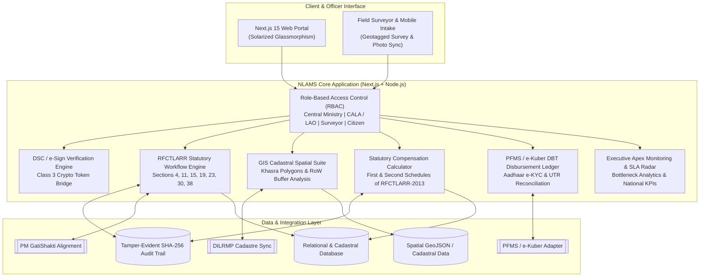
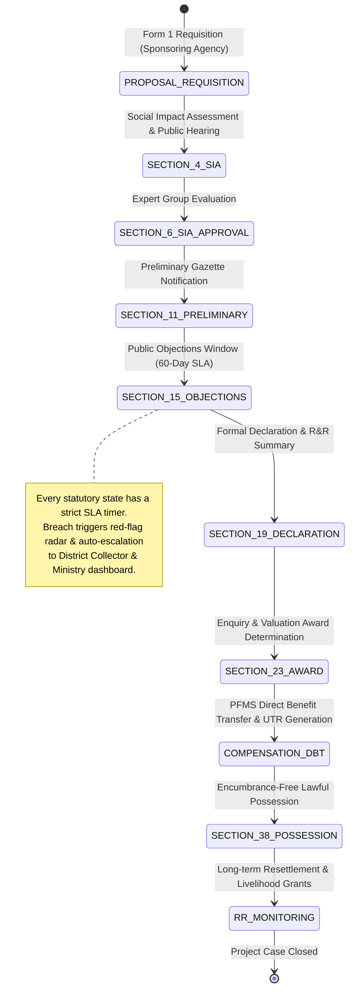

# SIH26016 — NLAMS: National Land Acquisition & Management System

> **A Real-Time, Unified Statutory Land Acquisition, GIS Cadastral Intelligence & DBT Lifecycle Platform**  
> **Sponsor:** Ministry of Rural Development / Department of Land Resources (DoLR), Government of India  
> **Category:** Software · **Theme:** Miscellaneous / Digital Governance

---

## 📌 Executive Summary & Problem Statement

Land acquisition for national infrastructure in India has historically suffered from **three critical pain points**:
1. **Administrative Fragmentation & Approval Latency**: Paper dossiers moving through multi-tier bureaucratic desks without statutory countdowns, causing multi-year project delays.
2. **Spatial Opacity & Boundary Disputes**: Lack of interactive cadastral polygon intelligence, leading to overlapping claims, Right-of-Way (RoW) violations, and litigation.
3. **Compensation & R&R Friction**: Opaque manual compensation valuation resulting in grievance petitions, leakage, and delayed Direct Benefit Transfers (DBT) to Project Affected Families (PAFs).

### The NLAMS Solution
**NLAMS** transforms the complete statutory lifecycle mandated by the **RFCTLARR Act, 2013** (*Right to Fair Compensation and Transparency in Land Acquisition, Rehabilitation and Resettlement Act, 2013*) into a **single-window digital command platform**:
- ⏱️ **Executable Workflow Engine**: Stage-gated statutory progression from Section 4 (SIA) to Section 38 (Possession) with automated SLA timers and red-flag breach alerts.
- 🗺️ **GIS Cadastral Spatial Core**: High-precision vector cadastral mapping with Khasra parcel inspection, 60m RoW corridor buffers, and dispute overlays.
- 🧮 **RFCTLARR-2013 Mathematical Engine**: Automated determination of Market Value, Rural Distance Multipliers ($1.00\times$ to $2.00\times$), statutory 100% Solatium, and 12% p.a. additional interest.
- 💳 **Direct Benefit Transfer (DBT) Ledger**: Integration-ready beneficiary payout pipeline connected to PFMS and e-Kuber with Aadhaar e-KYC validation.
- 🔐 **Cryptographic Integrity & Multi-Role RBAC**: Class 3 Digital Signature Certificate (DSC) / e-Sign token validation and verifiable digital receipts.

---

## 🏛️ System Architecture



---

## ⚖️ Statutory RFCTLARR-2013 Lifecycle State Machine



---

## 🧮 Mathematical Valuation Formula (RFCTLARR 2013)

Under Sections 26–30 and the First Schedule of the RFCTLARR Act 2013, the total statutory compensation payable for a parcel is determined as:

$$
\text{Total Award } (C) = \big( \text{Base Market Value} \times F \big) + V_{\text{assets}} + \text{Solatium} + I_{12\%} + G_{\text{R\&R}}
$$

Where:
- **$\text{Base Market Value (MV)}$**: $\max(\text{Circle Rate}, \text{Average 3-Year Sale Deeds}, \text{Consented Amount}) \times \text{Area Extent (Ha)}$
- **$F$ (Rural Multiplier Factor)**: Sliding factor based on distance from nearest urban boundary:
  - $\le 10\text{ km} \implies 1.25\times$
  - $10 - 20\text{ km} \implies 1.50\times$
  - $20 - 30\text{ km} \implies 1.75\times$
  - $> 30\text{ km} \implies 2.00\times$
  - Urban Areas $\implies 1.00\times$
- **$V_{\text{assets}}$**: Form 16/17 valuation of structures, tube-wells, teak/neem trees, standing crops.
- **$\text{Solatium}$**: Mandatory **100%** statutory markup on multiplied land and asset value:
  $$\text{Solatium} = 1.00 \times \big( (\text{MV} \times F) + V_{\text{assets}} \big)$$
- **$I_{12\%}$**: Additional statutory interest at **12% per annum** calculated from Section 4(2) notification date to date of Award publication.
- **$G_{\text{R\&R}}$**: Mandatory rehabilitation and resettlement one-time grant under the Second Schedule.

---

## 💻 Tech Stack & Architecture

| Layer | Technology | Purpose |
|---|---|---|
| **Frontend Framework** | **Next.js 15 (App Router) + React 19** | Server-rendered & interactive client components, instant route transitions |
| **Language** | **TypeScript 5.7** | Strict end-to-end type safety across domain models and API schemas |
| **Styling & Design System** | **Tailwind CSS + Vanilla CSS** | **Solarized Light & Glassmorphic Minimalism** (`#fdf6e3` parchment base, frosted glass blur, low-contrast high-density ergonomics) |
| **Icons & Visuals** | **Lucide React + Material Symbols** | Accessible, clean statutory iconography |
| **Spatial / GIS Engine** | **Leaflet / React-Leaflet + SVG Spatial Engine** | Cadastral parcel visualization, Right-of-Way (RoW) buffer styling, Khasra inspector |
| **Backend & API Layer** | **Node.js + Next.js Route Handlers** | High-performance REST API endpoints for acquisitions, parcels, and formulas |
| **Statutory Calculation** | **Pure TypeScript Engine** | Deterministic, audited RFCTLARR mathematical computation |

---

## 📂 Project Structure

```
ByteMe/
├── src/
│   ├── app/                                 # Next.js App Router
│   │   ├── page.tsx                         # Interactive Landing Page with statutory timeline & KPIs
│   │   ├── login/page.tsx                   # Multi-role Auth (CALA, Admin, Surveyor, Citizen) + DSC e-Sign
│   │   ├── executive-dashboard/page.tsx     # National KPI Command, Stage Distribution, SLA Breach Matrix
│   │   ├── workflow/page.tsx                # Stage-gated dossier tracker (Sec 4 to 38) with e-Sign approvals
│   │   ├── gis-map/page.tsx                 # Interactive GIS Cadastral Map with RoW buffer & Khasra search
│   │   ├── compensation/page.tsx            # RFCTLARR Formula Engine & PFMS DBT Disbursement Ledger
│   │   ├── acquisitions/new/page.tsx        # 4-Step Requisition Intake Wizard (Form 1)
│   │   ├── thank-you/page.tsx               # Official Case Acknowledgment & Printable Receipt
│   │   ├── api/                             # REST API Route Handlers
│   │   │   ├── acquisitions/route.ts        # Acquisition Projects CRUD & Form 1 ingestion
│   │   │   ├── parcels/route.ts             # Cadastral parcels query & Khasra search API
│   │   │   ├── compensation/calculate/route.ts # Real-time statutory compensation API
│   │   │   └── stats/route.ts               # Aggregate national KPIs and SLA monitoring API
│   │   ├── layout.tsx                       # Root layout with Inter & JetBrains Mono typography
│   │   └── globals.css                      # Solarized light glassmorphic backdrop & custom utilities
│   ├── components/
│   │   └── layout/
│   │       ├── Navbar.tsx                   # Responsive top navigation with live system health & alerts
│   │       ├── Sidebar.tsx                  # Docked officer sidebar for operational modules
│   │       └── Footer.tsx                   # Official Government of India compliance footer
│   ├── lib/
│   │   ├── rfctlarr-engine.ts               # Pure RFCTLARR-2013 statutory compensation calculation engine
│   │   └── data/
│   │       ├── mock-projects.ts             # Realistic infrastructure projects (Expressways, Bullet Train, Solar)
│   │       └── cadastral-parcels.ts         # Geospatial Khasra coordinates, ownership & survey records
│   └── types/
│       └── index.ts                         # Complete TypeScript interfaces & domain models
├── tailwind.config.ts                       # Solarized palette & glassmorphism theme tokens
├── tsconfig.json                            # Strict TypeScript configuration
├── next.config.ts                           # Next.js runtime configuration
└── package.json                             # Dependencies and build scripts
```

---

## 🌟 Key Application Features

### 1. Executive National Monitoring Dashboard (`/executive-dashboard`)
- **Real-Time Cumulative Metrics**: 1,248 Active Projects, 45,210 Ha Acquired across 18 States, ₹12,400 Cr DBT Disbursed, 91.4% SLA Compliance.
- **Statutory Stage Distribution**: Visual breakdown of projects across Section 4 (SIA), Section 11, Section 19, Section 23, and Section 38.
- **Early Warning & SLA Breach Radar**: Automated detection of delayed Section 11 inquiry hearings and judicial litigation stays under Section 64.

### 2. Operational Workflow Manager (`/workflow`)
- **Multi-Case Dossier Switcher**: Inspect case files such as *Delhi-Mumbai Expressway Package 4*, *Bullet Train Corridor*, or *Dholera SIR*.
- **Stage-Gated Stepper**: Milestone checklist with statutory section citations, remaining SLA days, and verified official gazette PDFs.
- **Cryptographic Approval Trigger**: Single-click e-Sign digital signature milestone progression.

### 3. GIS Cadastral Spatial Suite (`/gis-map`)
- **Vector Cadastral Canvas**: Interactive polygons representing individual revenue Khasra numbers (e.g. *Plot 42A*, *Plot 108/2*, *Plot 219B*).
- **Layer Controls**: Instant toggle for Cadastral Boundaries, 60m Right-of-Way (RoW) corridor buffer, and disputed litigation zones.
- **Cadastral Inspector Drawer**: Inspect land classification (irrigated/unirrigated), owner details, Aadhaar linkage, circle rates, tree/structure count, and one-click transfer to the compensation engine.

### 4. Statutory Compensation & R&R Portal (`/compensation`)
- **Interactive Formula Sliders**: Adjust Base Circle Rate, Area Extent, Urban vs. Rural classification, Distance Multiplier, and asset valuations.
- **Itemized Award Breakdown**: Detailed statutory breakdown including Base Value, Multiplier Factor, 100% Solatium, 12% Interest, and R&R grants.
- **PFMS / e-Kuber DBT Ledger**: Disburse direct benefit payments with instant UTR generation and status tracking.

### 5. Form 1 Project Requisition Intake Wizard (`/acquisitions/new`)
- **4-Step Guided Wizard**:
  1. *Project Details*: Sponsoring agency (NHAI, Railways, State Infra), project code, state, and districts.
  2. *Spatial Extent*: Total hectares, revenue villages, affected families, and Khasra GeoJSON/Shapefile upload.
  3. *SIA Mandate*: Designated SIA institution, public hearing scheduling, and sanctioned budget.
  4. *DSC e-Sign*: Cryptographic CALA digital certificate signature.

### 6. Official Case Acknowledgment & Receipt (`/thank-you`)
- Verifiable Case Reference ID (`ACQ-2024-8842-A`), registration timestamp, gazette sync queue status, and printable PDF receipt.

### 7. Authentication & DSC e-Sign Portal (`/login`)
- Role switcher: CALA / LAO, System Admin, Field Surveyor, Citizen / PAF.
- Simulated Class 3 hardware USB Crypto Token (e-Pass2003) e-Sign flow.

---

## 🚀 Getting Started Locally

### Prerequisites
- **Node.js**: v18.18.0 or newer (tested on v25.2.1)
- **npm**: v9.0.0 or newer (tested on v11.16.0)

### Installation & Execution

1. **Clone the repository:**
   ```bash
   git clone https://github.com/divyanshuj91/ByteMe.git
   cd ByteMe
   ```

2. **Install dependencies:**
   ```bash
   npm install
   ```

3. **Start the development server:**
   ```bash
   npm run dev
   ```

4. **Access the application:**
   Open your browser and navigate to `http://localhost:3000`.

5. **Build for production:**
   ```bash
   npm run build
   npm run start
   ```

---

## 📡 REST API Reference

| Method | Endpoint | Description | Sample Response |
|---|---|---|---|
| `GET` | `/api/acquisitions` | Query all active acquisition projects | `{ success: true, total: 4, data: [...] }` |
| `POST` | `/api/acquisitions` | Ingest new Form 1 project requisition | `{ success: true, message: "Project initiated", data: {...} }` |
| `GET` | `/api/parcels` | Query cadastral parcels by Khasra/owner | `{ success: true, total: 5, data: [...] }` |
| `POST` | `/api/compensation/calculate` | Compute statutory RFCTLARR compensation | `{ success: true, calculation: { totalPayableLakhs: 92.4, ... } }` |
| `GET` | `/api/stats` | Fetch executive KPIs & SLA breach radar | `{ success: true, data: { totalProjects: 1248, ... } }` |

---

## 🛡️ Edge Cases & Mitigation Strategies

| Failure Mode | Impact | NLAMS Mitigation |
|---|---|---|
| **Litigation Hold on Parcel** | Illegal or premature disbursement | Hard workflow lock: `surveyStatus === 'DISPUTED'` blocks DBT disbursement and flags the case to the Tribunal. |
| **SLA Breach / Approval Stall** | Project timeline blowout | Automated red-flag scanner marks cases exceeding statutory days and auto-escalates to higher administrative tier. |
| **Rural Multiplier Miscalculation** | Unfair compensation & farmer distress | Enforced distance-to-urban sliding curve ($1.25\times$ to $2.00\times$) with statutory 100% Solatium doubling. |
| **Duplicate PAF Claims** | Financial leakage | Aadhaar e-KYC validation & unique Khasra number deduplication keys. |
| **Offline Field Survey Disconnection** | Data loss in remote revenue villages | Client-side state caching with background synchronization upon reconnect. |

---

## 👥 Hackathon Team & Contribution

- **Team Name**: ByteMe
- **Problem Statement ID**: SIH26016
- **Theme**: Digital Governance & Land Management
- **Target Beneficiaries**: Ministry of Rural Development, State Revenue Departments, District Collectors (CALA/LAO), and Project Affected Citizens (PAFs).

---

## 📄 License & Compliance

Developed for the **Smart India Hackathon (SIH)**. Strictly complies with statutory mandates outlined under the **RFCTLARR Act, 2013 (Act 30 of 2013)** and Government of India digital governance guidelines.
