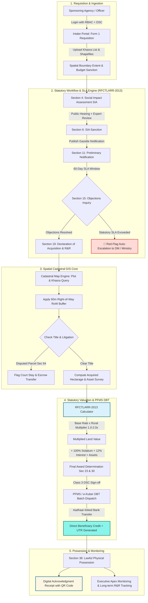

# SMART INDIA HACKATHON 2026 — IDEA SUBMISSION

## 🏆 Project Details & Team Information

| Field | Details |
|---|---|
| **Problem Statement ID** | **SIH26016** |
| **Problem Statement Title** | **Real-Time National Land Acquisition & Management System (NLAMS)** |
| **Sponsoring Agency** | Ministry of Rural Development / Department of Land Resources (DoLR) |
| **Theme** | Miscellaneous / Digital Governance |
| **Category** | Software |
| **Team Name** | **ByteMe** |

### 👥 Team Members
1. **Ayush Debnath**
2. **Divyanshu Jha**
3. **Karan Ray**
4. **Krishnendu Dutta**
5. **Mahek**
6. **Priyansi Das**

---

# SLIDE 1: TITLE & EXECUTIVE SUMMARY

### **NLAMS: National Land Acquisition & Management System**
> A unified, real-time web platform that digitizes the **entire RFCTLARR-2013 land-acquisition lifecycle** — from Project Requisition $\rightarrow$ SIA $\rightarrow$ Section 4 Notification $\rightarrow$ Section 19 Declaration $\rightarrow$ Valuation & Award $\rightarrow$ PFMS DBT Disbursement $\rightarrow$ Possession & R&R Monitoring — with live GIS Cadastral Intelligence, an Executable Statutory Workflow Engine, and Tamper-Evident Audit Trails.

---

# SLIDE 2: PROPOSED SOLUTION & INNOVATION

### 1. The Core Problem
- **Approval Latency**: Paper-based dossiers move across central, state, and district desks without accountability, causing 3–5 year delays on mega infrastructure projects.
- **Cadastral Opacity**: Scanned revenue maps fail to highlight Right-of-Way (RoW) overlaps, leading to court stays and title disputes.
- **Compensation Friction**: Manual calculations result in math errors, farmer grievances, and slow disbursals to Project Affected Families (PAFs).

### 2. The NLAMS Solution (3 Core Pillars)
1. **Executable Statutory Workflow Engine**: Every milestone from Section 4 to Section 38 is an enforceable state with automated SLA timers and red-flag escalation to higher administrative tiers.
2. **High-Precision GIS Cadastral Core**: Interactive vector cadastral map linking Khasra revenue polygons with 60m Right-of-Way (RoW) corridor buffers and litigation alerts.
3. **RFCTLARR-2013 Statutory Valuation & PFMS DBT**: Pure mathematical computation of Base Market Value, Rural Distance Multipliers ($1.00\times$ to $2.00\times$), statutory 100% Solatium, and 12% interest, integrated directly with a transparent Direct Benefit Transfer ledger.

### 3. Key Innovations & Uniqueness
- **Statutory Formula Engine**: Instant, unalterable award calculation complying strictly with the First Schedule of the RFCTLARR Act, 2013.
- **Interactive Cadastral RoW Overlay**: Real-time spatial query isolating affected parcels and exact acquired hectarage.
- **Cryptographic Token e-Sign / DSC**: Digital signature enforcement for gazette notifications and disbursement approvals.
- **Solarized Light Glassmorphism**: Low-strain, high-density government portal design designed for prolonged operational use.

---

# SLIDE 3: TECHNICAL APPROACH & SYSTEM WORKFLOW

### 1. Technology Stack
- **Frontend / Client Layer**: Next.js 15 (App Router), React 19, TypeScript 5.7, Tailwind CSS (Solarized Light `#fdf6e3` & Glassmorphism), Lucide Icons.
- **GIS & Mapping Engine**: Leaflet, PostGIS spatial data models, vector SVG cadastral layers with dynamic RoW buffer projection.
- **Backend & Middleware**: Node.js REST Route Handlers, Camunda BPMN workflow choreography, Kafka event streams.
- **Security & Data**: Keycloak Multi-tier RBAC, Class 3 Hardware DSC / e-Sign bridge, SHA-256 hash-chain tamper-evident audit.

---

### 2. End-to-End Application Workflow (How NLAMS Works)



---

### 3. Detailed Step-by-Step Flow Description
1. **User Authentication**: CALA, Administrator, Surveyor, or Citizen logs in with multi-tier RBAC and simulated Class 3 DSC token.
2. **Project Requisition**: Sponsoring agency (NHAI, Railways, Metro) creates a Form 1 requisition with spatial boundary polygons and budget sanction.
3. **Statutory Progression**: The case moves through Section 4 (SIA) $\rightarrow$ Section 11 (Gazette) $\rightarrow$ Section 19 (Declaration). If an officer delays past statutory deadlines, the system automatically triggers an **SLA Breach Red-Flag** on the Executive Command Dashboard.
4. **GIS Cadastral Inspection**: Surveyors and officers interact with the GIS Cadastral Suite to inspect Khasra polygons, verify survey status, and apply 60m RoW corridor buffers.
5. **Statutory Award Valuation**: The system calculates the award using the exact RFCTLARR formula:
   $$\text{Award} = (\text{Market Value} \times \text{Rural Multiplier}) + \text{Assets} + \text{100\% Solatium} + \text{12\% Interest} + \text{R\&R Grant}$$
6. **DBT Disbursement**: CALA signs the compensation sheet via DSC; the payment batch is queued to PFMS/e-Kuber, generating real-time UTRs.
7. **Receipt & Audit**: An official digitally signed Acknowledgment Receipt with a verifiable QR code is generated.

---

# SLIDE 4: FEASIBILITY AND VIABILITY

### 1. Feasibility Analysis
- **Technical Feasibility**: Built on modular, standard web technologies (Next.js 15, TypeScript, Node.js, PostGIS, Leaflet) that scale horizontally and run on standard NIC cloud infrastructure.
- **Operational Feasibility**: Mirrors the exact legal workflows of the RFCTLARR Act 2013 and revenue department hierarchies (Central Ministry $\rightarrow$ State Revenue $\rightarrow$ CALA $\rightarrow$ Patwari/Surveyor).
- **Financial Viability**: Eliminates duplicate survey expenditures, prevents litigation-driven interest accrual, and minimizes administrative overhead.

### 2. Potential Challenges & Mitigation Strategies

| Challenge / Risk | Impact | NLAMS Mitigation Strategy |
|---|---|---|
| **Title Litigation Holds** | Unauthorized or premature disbursal | **Hard Workflow Guard**: Parcels flagged as `DISPUTED` under Section 64 reference are locked from DBT, routing funds to escrow automatically. |
| **SLA Breach / Approval Storms** | Alert fatigue for senior officials | **Debounced Tiered Alerts**: Batching escalation digests prioritized by project budget and delay duration. |
| **Cadastral Polygon Inconsistencies** | Inaccurate area measurement | Automated `ST_MakeValid` topology correction and manual GIS surveyor verification flags. |
| **Rural Multiplier Inaccuracies** | Farmer dissatisfaction | Enforced distance sliding formula ($1.00\times$ to $2.00\times$) locked by GIS boundary computation. |
| **Duplicate PAF Compensation Claims** | Financial leakage | Unique Khasra number deduplication keys and Aadhaar e-KYC bank verification. |

---

# SLIDE 5: IMPACT AND BENEFITS

### 1. Quantifiable Benefits
- **65% Reduction in Approval Latency**: Automated statutory stage transitions and SLA escalations eliminate paper dossier stagnation.
- **100% Transparent DBT**: Direct benefit transfer via PFMS with real-time UTR reconciliation stops middleman leakage.
- **90% Drop in Boundary Disputes**: Pre-aligned 60m RoW corridor buffers and cadastral layer overlays prevent accidental encroachment.

### 2. Multi-Stakeholder Impact
- **For Central Ministries & Sponsoring Agencies (NHAI, Railways, MoRTH)**: Real-time national KPI command view, expenditure vs. budget tracking, and accelerated infrastructure commissioning.
- **For District Collectors & CALA Officers**: Single-window case dossier, automated document verification checklists, and single-click DSC e-Sign authorizations.
- **For Landowners & Displaced Families (PAFs)**: Complete transparency on market rates, 100% Solatium entitlements, instant SMS/receipt status, and fair R&R resettlement grants.

---

# SLIDE 6: RESEARCH AND REFERENCES

1. **The Right to Fair Compensation and Transparency in Land Acquisition, Rehabilitation and Resettlement Act, 2013 (Act No. 30 of 2013)** — Ministry of Law and Justice, Government of India.
2. **First Schedule (Section 26 to 30)**: Criteria for determining Compensation & Solatium.
3. **Second & Third Schedules**: Elements of Rehabilitation and Resettlement (R&R) entitlements.
4. **Digital India Land Records Modernization Programme (DILRMP)** — Department of Land Resources (DoLR).
5. **PM GatiShakti National Master Plan**: Spatial planning and infrastructure alignment standards.
6. **Public Financial Management System (PFMS)**: Direct Benefit Transfer (DBT) and e-Kuber integration protocols.

---

# 💻 LOCAL INSTALLATION & WORKING PROTOTYPE

```bash
# 1. Clone the repository
git clone https://github.com/divyanshuj91/ByteMe.git
cd ByteMe

# 2. Install dependencies
npm install

# 3. Start local development server
npm run dev

# 4. Open in browser
http://localhost:3000

# 5. Build for production verification
npm run build
npm run start
```

### 📍 Available Prototype Routes
- **Landing Page**: `http://localhost:3000/`
- **Login & DSC e-Sign**: `http://localhost:3000/login`
- **Executive Dashboard**: `http://localhost:3000/executive-dashboard`
- **Workflow Dossier Tracker**: `http://localhost:3000/workflow`
- **GIS Cadastral Suite**: `http://localhost:3000/gis-map`
- **Compensation & DBT Calculator**: `http://localhost:3000/compensation`
- **New Requisition Intake Wizard**: `http://localhost:3000/acquisitions/new`
- **Official Submission Receipt**: `http://localhost:3000/thank-you`
